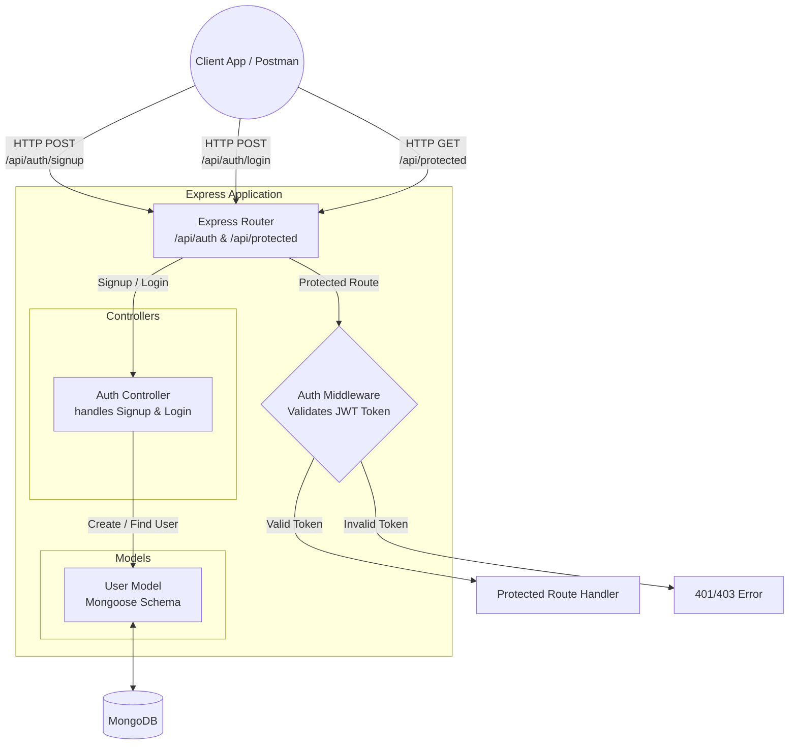

# 🔐 Secure Authentication System (Node.js)

A robust and secure backend authentication system built with **Node.js, Express, MongoDB**, and **JSON Web Tokens (JWT)**. This project provides a reliable foundation and boilerplate for handling user registration, secure login, and JSON Web Token based route protection.

---

## 🎯 Features

- **User Registration**: Secure sign-up process with automatic password hashing.
- **User Login**: Validates credentials against the database and issues a secure signed JWT.
- **Password Encryption**: Uses `bcrypt` for applying a one-way hash to user passwords before securely saving them to MongoDB.
- **Protected Routes**: Middleware (`authMiddleware.js`) ensures only validated users possessing a valid JWT can access protected endpoints.
- **Environment Variables**: Managed securely through `dotenv` for keeping secrets out of the codebase.

---

## 🏗️ Architecture Design



---

## 💻 Tech Stack

- **Runtime**: Node.js
- **Framework**: Express.js
- **Database**: MongoDB (via Mongoose ODM)
- **Security**: `bcrypt` (password hashing), `jsonwebtoken` (JWT logic)
- **Environment**: `dotenv`

---

## 📂 Folder Structure

```text
auth-system/
├── src/
│   ├── config/
│   │   └── db.js               # MongoDB connection logic
│   ├── controllers/
│   │   └── authController.js   # Logic for handling user login and signup
│   ├── middleware/
│   │   └── authMiddleware.js   # JWT validation middleware function
│   ├── models/
│   │   └── User.js             # Mongoose database schema for User entity
│   └── routes/
│       └── authRoutes.js       # Express routes for authentication
├── .env                        # Environment variables (Git ignored)
├── .env.example                # Example template for environment variables
├── server.js                   # Main application entry point
└── package.json                # Project NPM dependencies and configuration scripts
```

---

## 🚀 Getting Started

### 1. Prerequisites
- [Node.js](https://nodejs.org/) installed on your machine
- [MongoDB](https://www.mongodb.com/) cluster URI or local MongoDB instance running

### 2. Installation
Clone the repository and install the NPM dependencies:

```bash
# Navigate to the project directory
cd auth-system

# Install dependencies using npm
npm install
```

### 3. Environment Configuration
Create a `.env` file in the root of the project directory based on the `.env.example`:

```bash
cp .env.example .env
```
Inside the newly created `.env` file, supply your actual connection URI and secret:
```env
MONGO_URI=mongodb+srv://<username>:<password>@cluster0.xyz.mongodb.net/<dbname>
JWT_SECRET=generate_your_own_secret_key_here
```

### 4. Run the Server
Launch the development server using nodemon/node:

```bash
# If you have nodemon installed globally or in NPM scripts:
npx nodemon server.js
# Or standard Node execution:
node server.js
```
The server will typically start and listen for connections on port `3000`.

---

## 📡 API Endpoints

### 1. 🟢 Server Health Check
- **Endpoint**: `GET /`
- **Description**: Returns a standard heartbeat message verifying the API is active.

### 2. 📝 User Signup
- **Endpoint**: `POST /api/auth/signup`
- **Description**: Register a new user account into the system.
- **Body Context**:
  ```json
  {
    "email": "user@example.com",
    "password": "securepassword123"
  }
  ```
- **Success Response** (200 OK):
  ```json
  {
    "msg": "User registered succesfully"
  }
  ```

### 3. 🔑 User Login
- **Endpoint**: `POST /api/auth/login`
- **Description**: Authenticate credentials; returns a JWT used for subsequent authorized requests.
- **Body Context**:
  ```json
  {
    "email": "user@example.com",
    "password": "securepassword123"
  }
  ```
- **Success Response** (200 OK):
  ```json
  {
    "token": "eyJhbGciOiJIUzI1NiIsInR5cCI6..."
  }
  ```

### 4. 🛡️ Protected Route Example
- **Endpoint**: `GET /api/protected`
- **Description**: An endpoint strictly protected behind `authMiddleware` JWT validation.
- **Headers Needed**:
  ```http
  Authorization: <token_received_from_login_endpoint>
  ```
- **Success Response** (200 OK):
  ```json
  {
    "msg": "You accessed protected route!"
  }
  ```

---

> **Development Note**: This architecture serves as an excellent boilerplate for standard MERN/MEAN stack applications requiring secure user authentication flows. For production environments, remember to securely store JWT tokens on the client side (e.g., using `httpOnly` cookies), apply rate limiting against Brute-Force/DDoS attacks, and always sanitize inputs to prevent injection attacks!
